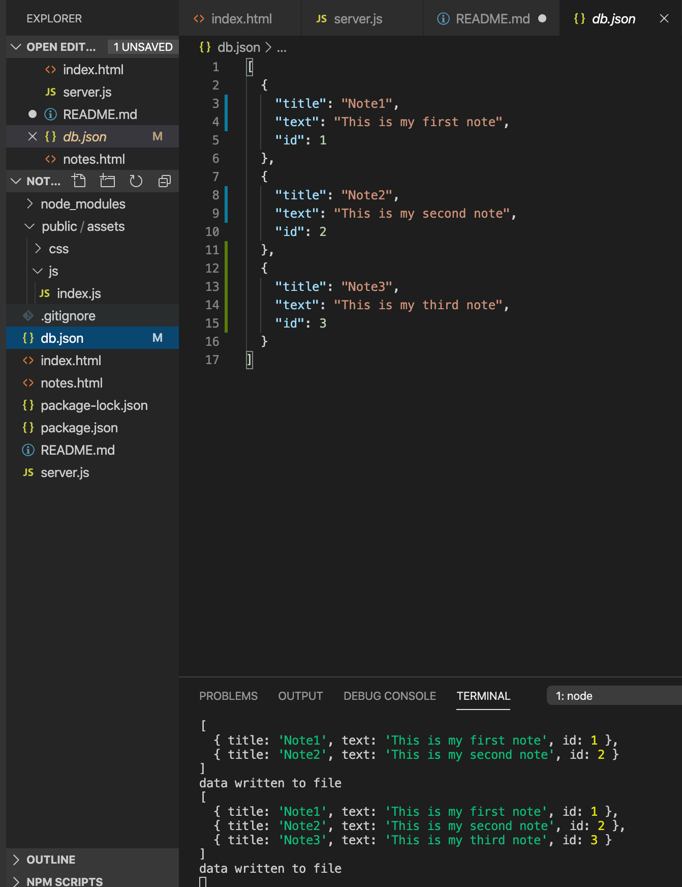

# notetaker

I set up public folder and linked the CSS

Set up routes with Express

Set up POST route and wrote db.json file with notes array of json objects

Created a unique ID for each post which can be viewed on api/notes

Set up api/notes/ID so user can delete note based on unique ID